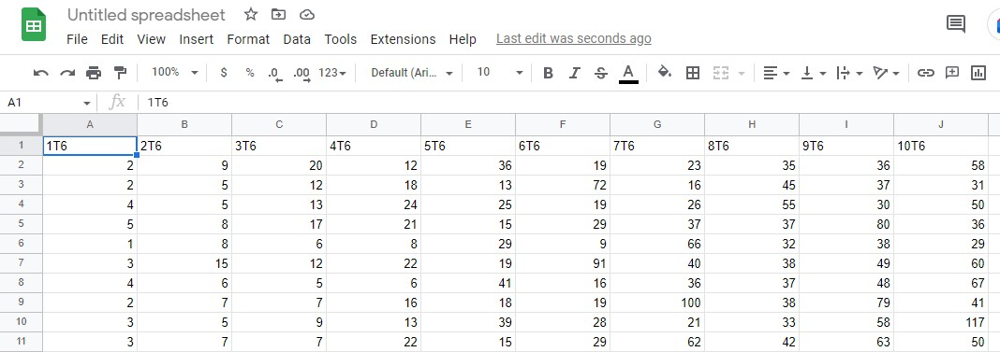
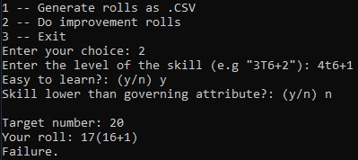

# EonDiceRoller
I made this as a hobby project coding my first python app. The goal is to provide some tools for the tabletop RPG Eon.

## Features
It currently features two tools:

### .CSV Generation
Generates a .CSV-file with a dice pool ranging from 1D6 to 10D6 for the Game Master to use as pre-rolled results. Each pool is given 100 dice results.
Example when importing the file in Google Sheets:
	

---

### Improvement rolls
Tool for speeding up the process of improvement rolls. The tool automatically calculates the difficulty and generates a roll against it. 
Example:  

